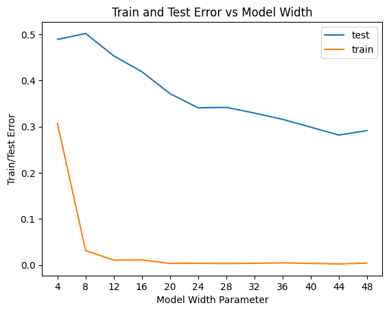
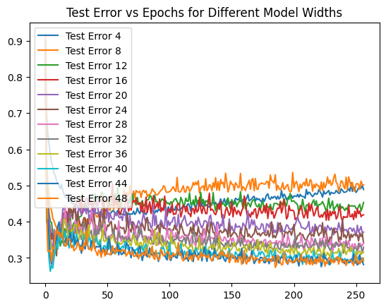

# Deep Double Descent Reproduction

This is a reproduction of some of the OpenAI paper ["Deep Double Descent"](https://arxiv.org/abs/1912.02292).

The original paper is about the phenomenon of double descent in deep learning. The authors show that the test error of a deep neural network can first decrease, then increase, and then increase again as the number of parameters increases. This is in contrast to the classical understanding of overfitting, which predicts that the test error should increase monotonically as the model complexity increases.

## GRAPHS

Error vs. Width Parameter of model:

Test Error vs. Epochs for Different Model Widths:

